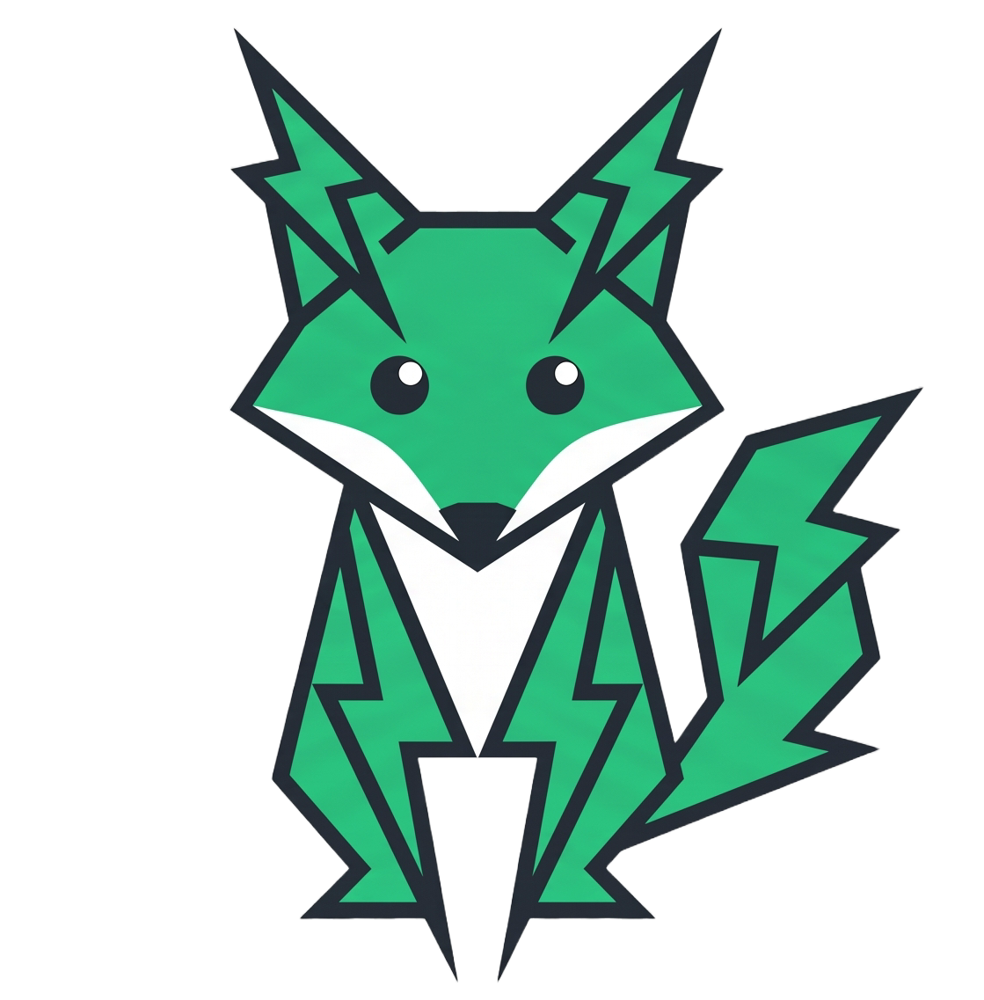

# ⚡ TaskForge

<p align="center">
  
</p>

<p align="center">
  <strong>High-Performance Asynchronous Distributed Job Engine for .NET 8</strong>
  <br />
  Built with <code>System.Threading.Channels</code>, React, and Docker
  <br />
  <a href="https://github.com/TYFALY/TaskForge/actions/workflows/ci.yml"></a>
  <a href="https://www.nuget.org/packages/TaskForge"></a>
  <a href="https://github.com/TYFALY/TaskForge/blob/main/LICENSE"></a>
</p>

---

## 🎯 Project Overview

**TaskForge** is a modern, lightweight asynchronous distributed job processing engine built specifically for .NET 8. It provides ultra-low latency job queuing via in-memory channels, real-time observability via Server-Sent Events (SSE), and a zero-configuration React dashboard—all packaged in a single Docker container.

### Key Characteristics

- **In-Memory Channels**: Uses `System.Threading.Channels` for lock-free, high-throughput job buffering
- **Webhook-First Design**: Executes HTTP webhooks with retry logic and dead-letter queues
- **Real-Time Dashboard**: Built-in React + Tailwind dashboard with live SSE updates
- **Zero-Config**: Works out of the box with SQLite, no external dependencies required
- **Docker-Ready**: Single-stage or multi-stage production builds with health checks

---

## 🏗️ Architecture & System Design

```
┌─────────────────────────────────────────────────────────────────────────────┐
│                              CLIENT LAYER                                    │
│         (cURL, Postman, Browser, Mobile App, CI/CD Pipeline)               │
└────────────────────────────────┬────────────────────────────────────────────┘
                                 │ HTTP POST /api/v1/jobs/enqueue
                                 ▼
┌─────────────────────────────────────────────────────────────────────────────┐
│                      TASKFORGE API (ASP.NET Core 8)                        │
│  ┌────────────────┐    ┌────────────────┐    ┌────────────────────────┐   │
│  │  Web API       │───▶│  Job           │───▶│  Channel Buffer        │   │
│  │  Controllers    │    │  Controller     │    │  (RAM - Channels)      │   │
│  └────────────────┘    └────────────────┘    └───────────┬────────────┘   │
│  ┌────────────────┐    ┌────────────────┐                 │                 │
│  │  SSE Stream    │◀───│  Job           │◀───│  Background Job       │   │
│  │  /stream      │    │  Broadcaster   │    │  Processor             │   │
│  └────────────────┘    └────────────────┘    └───────────┬────────────┘   │
│  ┌────────────────┐    ┌────────────────┐                 │                 │
│  │  Health       │    │  Webhook      │───────────────▶│  External HTTP   │   │
│  │  /health     │    │  Executor      │    │  Targets              │   │
│  └────────────────┘    └────────────────┘    └────────────────────────┘   │
└────────────────────────────────┬────────────────────────────────────────────┘
                                 │
                                 ▼
                    ┌───────────────────────┐
                    │   SQLite / PostgreSQL  │
                    │   (Job Persistence)    │
                    └───────────────────────┘
```

### Data Flow

```
1. INGESTION     Client ──POST──▶ API ──Buffer──▶ In-Memory Channel
2. PROCESSING    Channel ──Dequeue──▶ Worker ──Execute──▶ Webhook/HTTP
3. PERSISTENCE   Worker ──Save──▶ SQLite (or PostgreSQL)
4. BROADCAST     Status Change ──▶ SSE Stream ──▶ Dashboard UI
```

---

## ⚙️ Core Technical Features

### 🧵 System.Threading.Channels (Lock-Free Buffering)

High-performance, lock-free queue implementation for job buffering:

```csharp
// Non-blocking channel for job enqueue
await _jobChannel.Writer.WriteAsync(newJob, cancellationToken);

// Background worker processes jobs
await foreach (var job in _jobChannel.Reader.ReadAllAsync(ct))
{
    await ProcessJobAsync(job, ct);
}
```

**Benefits:**
- Lock-free, CAS-based operations
- Bounded channels prevent memory exhaustion
- Back-pressure support for load shedding

### 🔄 Webhook Execution Engine

Robust webhook delivery with retry logic:

```csharp
public class WebhookExecutor
{
    public async Task<JobResult> ExecuteAsync(Job job, CancellationToken ct)
    {
        using var client = new HttpClient { Timeout = TimeSpan.FromSeconds(30) };
        var response = await client.PostAsync(job.WebhookUrl, job.Content, ct);
        return new JobResult { Success = response.IsSuccessStatusCode };
    }
}
```

**Features:**
- Configurable timeout (default: 30 seconds)
- Retry with exponential backoff (3 retries)
- Dead-letter queue for permanently failed jobs
- JSON payload support with nested data structures

### 📡 Server-Sent Events (SSE) Stream

Real-time dashboard updates without WebSocket complexity:

```csharp
[HttpGet("stream")]
public async Task StreamJobs(CancellationToken ct)
{
    Response.ContentType = "text/event-stream";
    await foreach (var jobEvent in _broadcaster.SubscribeAsync(ct))
    {
        await Response.WriteAsync($"data: {JsonSerializer.Serialize(jobEvent)}\n\n", ct);
        await Response.Body.FlushAsync(ct);
    }
}
```

**Event Types:** `JobEnqueued`, `JobStarted`, `JobCompleted`, `JobFailed`, `MetricsUpdate`

### 🎨 React + Tailwind Dashboard

Zero-configuration dashboard bundled directly into the API:

```
src/TaskForge.Api/wwwroot/
├── index.html
├── assets/index-[hash].js  (React app)
└── assets/index-[hash].css (Tailwind)
```

**Features:** Job enqueue form, real-time status table, traffic simulator, SSE connection indicator

### 🐳 Fully Dockerized Deployment

Multi-stage build ensures minimal image size (~150MB):

```dockerfile
FROM node:20-alpine AS frontend-build
COPY taskforge-ui/ ./
RUN npm ci && npm run build

FROM mcr.microsoft.com/dotnet/sdk:8.0-alpine AS backend-build
COPY --from=frontend-build /src/frontend/dist ./TaskForge.Api/wwwroot
RUN dotnet publish -c Release -o /app/out

FROM mcr.microsoft.com/dotnet/aspnet:8.0-alpine AS runtime
WORKDIR /app
COPY --from=backend-build /app/out .
RUN adduser -D appuser && chown -R appuser .
USER appuser
EXPOSE 8080
ENTRYPOINT ["dotnet", "TaskForge.Api.dll"]
```

---

## 🚀 Quickstart Guide (Docker)

### Prerequisites

- [Docker](https://docs.docker.com/get-docker/) (v20.10+)
- [Docker Compose](https://docs.docker.com/compose/install/) (v2.0+)

### 1. Generate an API Key

```bash
openssl rand -hex 32
```

### 2. Start the Application

```bash
# Set your API key
export TASKFORGE_API_KEY=$(openssl rand -hex 32)

# Start the container
docker compose up --build -d

# Verify health
curl http://localhost:5000/health
```

### 3. Open the Dashboard

Navigate to [http://localhost:5000](http://localhost:5000) to access the built-in React dashboard.

### 4. Submit a Test Job

```bash
curl -X POST http://localhost:5000/api/v1/jobs/enqueue \
  -H "Content-Type: application/json" \
  -H "X-TaskForge-Key: YOUR_API_KEY_HERE" \
  -d '{"queueName": "notifications", "payload": {"message": "Hello!"}, "maxRetries": 3}'
```

### 5. Stop the Container

```bash
docker compose down
```

---

## 📡 API Reference

### Authentication

All API endpoints require the `X-TaskForge-Key` header:

```
X-TaskForge-Key: YOUR_API_KEY_HERE
```

### Endpoints

#### `POST /api/v1/jobs/enqueue`

Enqueue a new job for processing.

**Request Body:**
```json
{
  "queueName": "notifications",
  "webhookUrl": "https://example.com/webhook",
  "payload": {"message": "Hello, World!"},
  "maxRetries": 3,
  "priority": 0
}
```

**Response (202 Accepted):**
```json
{
  "jobId": "550e8400-e29b-41d4-a716-446655440000",
  "status": "Queued",
  "enqueuedAt": "2026-09-06T18:30:00.500Z"
}
```

---

#### `GET /api/v1/jobs/{jobId}`

Get job status and details.

**Response (200 OK):**
```json
{
  "id": "550e8400-e29b-41d4-a716-446655440000",
  "status": "Completed",
  "queueName": "notifications",
  "enqueuedAt": "2026-09-06T18:30:00.500Z",
  "startedAt": "2026-09-06T18:30:00.800Z",
  "completedAt": "2026-09-06T18:30:01.200Z",
  "result": {"statusCode": 200, "message": "Webhook delivered successfully"},
  "attempts": 1,
  "maxRetries": 3
}
```

**Job Status Values:**

| Status | Description |
|--------|-------------|
| `Queued` | Job is in the buffer, waiting for worker |
| `Processing` | Worker is executing the job |
| `Completed` | Job finished successfully |
| `Failed` | Job failed after all retries |
| `DeadLettered` | Job moved to dead-letter queue |

---

#### `GET /api/v1/jobs/`

List all jobs with pagination.

**Query Parameters:** `page` (default: 1), `pageSize` (default: 20), `status`, `queueName`

**Response (200 OK):**
```json
{
  "items": [],
  "totalCount": 150,
  "page": 1,
  "pageSize": 20,
  "totalPages": 8
}
```

---

#### `GET /api/v1/jobs/stream`

Server-Sent Events stream for real-time job updates.

**Headers:** `Accept: text/event-stream`, `X-TaskForge-Key: API key`

**Event Format:**
```
event: job
data: {"type":"JobCompleted","jobId":"550e8400-...","status":"Completed"}

event: metrics
data: {"queueSize":15,"activeJobs":3,"completedJobs":142,"failedJobs":5}
```

---

#### `GET /api/v1/metrics`

Get current queue and job metrics.

**Response (200 OK):**
```json
{
  "queueSize": 15,
  "activeJobs": 3,
  "completedJobs": 142,
  "failedJobs": 5,
  "uptime": "02:30:45"
}
```

---

#### `GET /health`

Health check endpoint for container orchestration.

**Response (200 OK):**
```json
{
  "status": "Healthy",
  "timestamp": "2026-09-06T18:30:00Z"
}
```

---

## 🧪 Testing & Quality Assurance

### E2E Test Script

```powershell
# Run E2E tests against local container
.\test-e2e.ps1 -BaseUrl http://localhost:5000 -ApiKey "YOUR_API_KEY_HERE"
```

### Playwright Tests

```bash
cd taskforge-ui
npm install
npx playwright test
```

### Coverage Targets

| Component | Target |
|-----------|--------|
| API Endpoints | 100% |
| Background Workers | 95% |
| Webhook Executor | 90% |
| Dashboard Components | 80% |

---

## 🔧 Configuration

### Environment Variables

| Variable | Default | Description |
|----------|---------|-------------|
| `ASPNETCORE_ENVIRONMENT` | `Production` | Runtime environment |
| `ASPNETCORE_URLS` | `http://+:8080` | Binding address |
| `TaskForge__ApiKey` | (required) | API authentication |
| `TaskForge__Server__Port` | `8080` | Internal port |

### docker-compose.yml

```yaml
version: "3.9"

services:
  taskforge:
    build:
      context: .
      dockerfile: Dockerfile
    container_name: taskforge-api
    ports:
      - "5000:8080"
    environment:
      - ASPNETCORE_ENVIRONMENT=Production
      # IMPORTANT: Generate a secure API key for production use
      # Example: openssl rand -hex 32
      - TaskForge__ApiKey=${TASKFORGE_API_KEY:-CHANGE_ME_IN_PRODUCTION}
      - TaskForge__Server__Port=8080
    healthcheck:
      test: ["CMD", "wget", "--no-verbose", "--tries=1", "--spider", "http://localhost:8080/health"]
      interval: 30s
      timeout: 3s
      retries: 3
      start_period: 10s
    restart: unless-stopped
```

---

## 📁 Project Structure

```
TaskForge/
├── docs/                          # Documentation assets
│   ├── dashboard-preview.png
│   └── logo.png
├── scripts/                       # Utility scripts
│   └── send-live-jobs.ps1
├── src/                           # .NET source code
│   ├── TaskForge.Api/            # ASP.NET Core Web API
│   │   ├── Endpoints/            # Minimal API endpoints
│   │   ├── Middleware/           # API key authentication
│   │   ├── Metrics/              # Prometheus metrics
│   │   ├── wwwroot/              # Embedded React dashboard
│   │   └── Program.cs
│   ├── TaskForge.Benchmark/     # BenchmarkDotNet benchmarks
│   ├── TaskForge.Core/           # Shared models & interfaces
│   └── TaskForge.Worker/         # Background job processor
├── taskforge-ui/                  # React + Tailwind frontend
│   ├── src/                       # React components
│   ├── tests/                     # Playwright E2E tests
│   └── package.json
├── .dockerignore                  # Docker context exclusions
├── .gitignore                     # Git exclusions
├── docker-compose.yml             # Container orchestration
├── Dockerfile                     # Multi-stage production build
├── README.md                      # This file
├── DESIGN.md                      # Architecture decisions
├── LICENSE                        # MIT License
└── TaskForge.sln                 # Solution file
```

---

## 🤝 Contributing

1. **Fork the repository**
2. **Create a feature branch:** `git checkout -b feature/amazing-feature`
3. **Commit changes:** `git commit -m 'Add amazing feature'`
4. **Push to branch:** `git push origin feature/amazing-feature`
5. **Open a Pull Request**

### Development Setup

```bash
# Clone the repository
git clone https://github.com/TYFALY/TaskForge.git
cd TaskForge

# Start for development
docker compose up --build

# Run tests
dotnet test
npm test
```

---

## 📄 License

This project is licensed under the **MIT License** - see the [LICENSE](LICENSE) file for details.

---

<p align="center">
  Built with ❤️ for .NET developers
</p>

